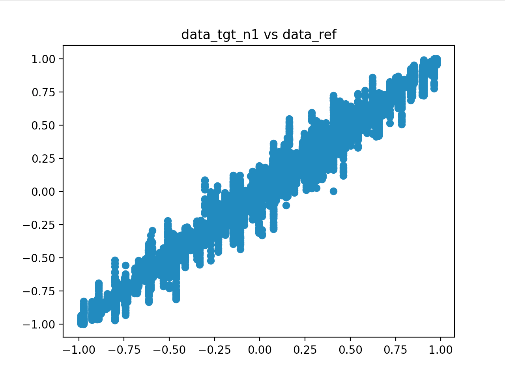
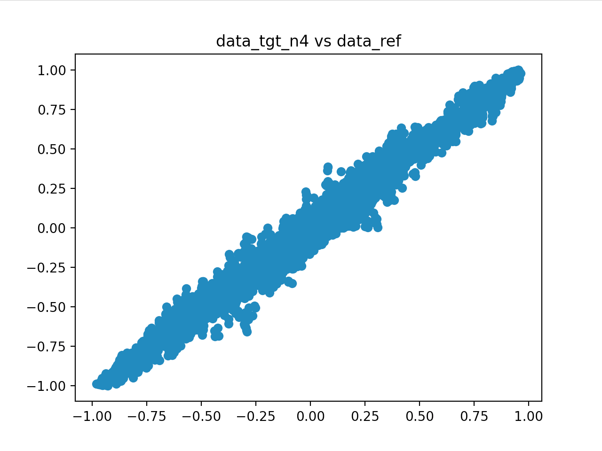
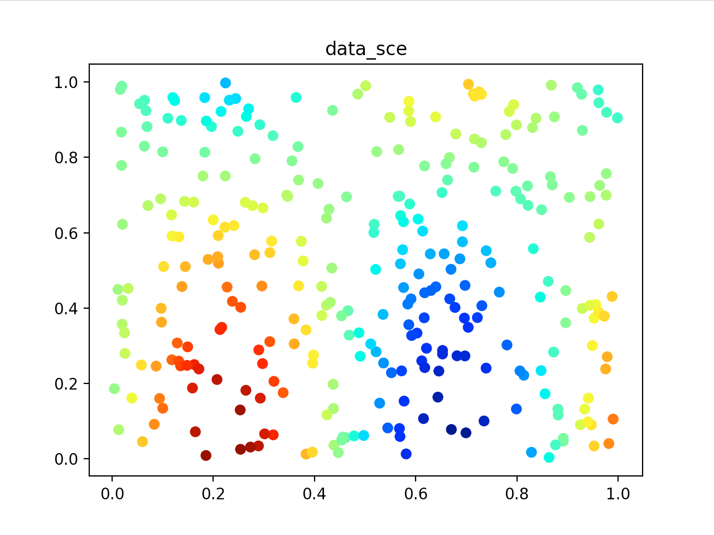
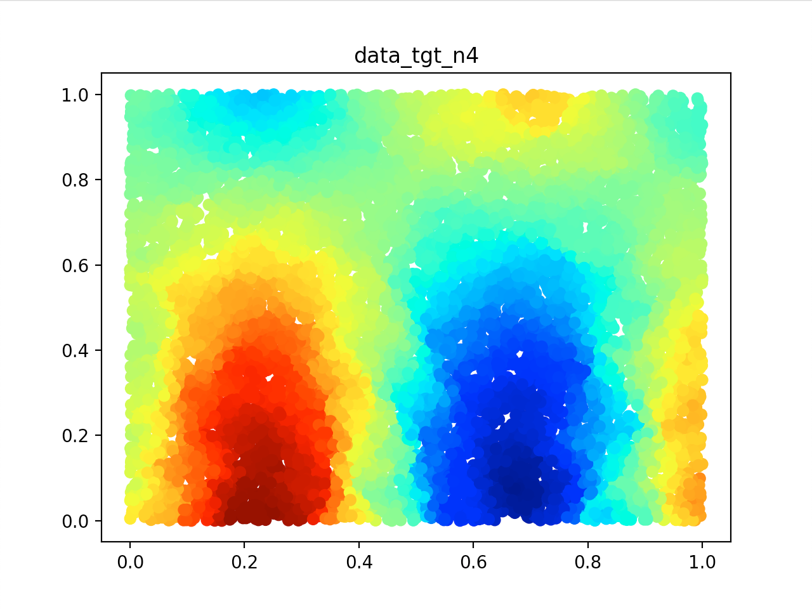
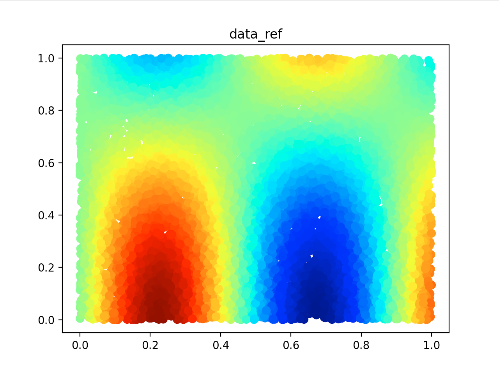

Example
=======
In this example we will interpolate data between two unstructured 2D meshes.
We start by creating the source and target meshes.
Their shape should be (nb_points, 2). There is multiple ways of building such meshes.
In this case we will start by creating each axis individually.

.. code-block:: python

	import numpy as np

	points_sce = 300
	points_tgt = 10000
	x,  y  = np.random.rand(2, points_sce) #source axis
	xi, yi = np.random.rand(2, points_tgt) #target axis

From this we can build the meshes.

.. code-block:: python

	mesh_sce = np.stack((x, y), axis=-1)
	mesh_tgt = np.stack((xi, yi), axis=-1)

Then we generate the data. In our case the data is generated from a function of sin and cos.

.. code-block:: python

	def field(x, y):
		return np.sin(x*7)*np.cos(y*2)

	data_sce = field(x, y)

This allows us to generate the data on the target mesh as well, so we can compare the "ground truth" with the interpolated results.

.. code-block:: python

	data_ref = field(xi, yi)

We will make two interpolations, one with 1 neighbour and the other with 4.

.. code-block:: python

	from cloud2cloud import cloud2cloud

	data_tgt_n1 = cloud2cloud(mesh_sce, data_sce, mesh_tgt, stencil=1)
	data_tgt_n4 = cloud2cloud(mesh_sce, data_sce, mesh_tgt, stencil=4)

Note that this is completely equivalent to:

.. code-block:: python

	from cloud2cloud import CloudInterpolator

	base_n1 = CloudInterpolator((x, y), (xi, yi), stencil=1)
	base_n4 = CloudInterpolator((x, y), (xi, yi), stencil=4)

	data_tgt_n1 = base_n1.interp(data_sce)
	data_tgt_n4 = base_n4.interp(data_sce)

Finally we can visualize and compare the results.

.. code-block:: python

	import matplotlib.pyplot as plt

	plt.plot(data_tgt_n1, data_ref, "o")
	plt.title("data_tgt_n1 vs data_ref")
	plt.show()

.. code-block:: python

	plt.plot(data_tgt_n4, data_ref, "o")
	plt.title("data_tgt_n4 vs data_ref")
	plt.show()

.. code-block:: python

	plt.scatter(x, y, cmap="jet", c=data_sce)
	plt.title("data_sce")
	plt.show()

.. code-block:: python

	plt.scatter(xi, yi, cmap="jet", c=data_tgt_n1)
	plt.title("data_tgt_n1")
	plt.show()

.. code-block:: python

	plt.scatter(xi, yi, cmap="jet", c=data_tgt_n4)
	plt.title("data_tgt_n4")
	plt.show()

.. code-block:: python

	plt.scatter(xi, yi, cmap="jet", s=50, c=data_ref)
	plt.title("data_ref")
	plt.show()

